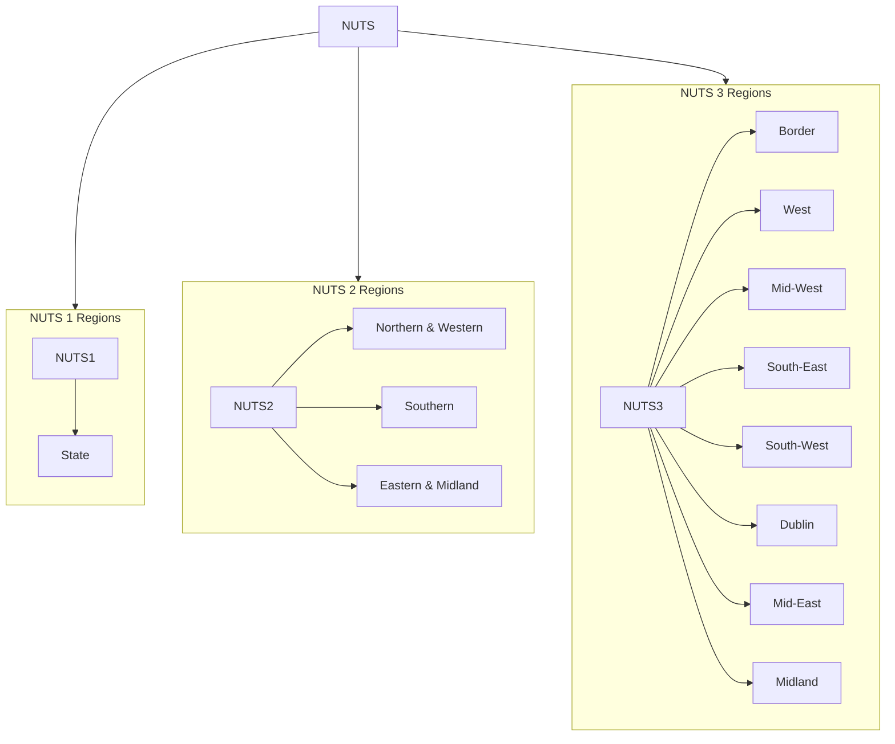

## Table of Contents
- [Data Dictionary](#data_dictionary)
- [Some cleaning](#cleaning_main_heading)
    - [Improving column names](#improving_column_names)
    - [Concise names for Statistic Label](#concise_names_for_stat_labels)
- [Data Exploration](#data_exploration)
  - [1. Dataset size](#dataset_size)
  - [2. Missing values](#missing_values)
  - [3. All Regions](#all_regions)
    - [Important Data Structure Consideration](#important_data_consider)
  - [4. Statistic Labels and their respective units](#stat_labels_and_units)
  - [5. Sum aggregation of values](#sum_of_values)
    - [Step-by-step breakdown of how the query works](#step_by_step_breakdown)
  - [6. Time trend analysis](#time_trend_analysis)
      - [Number of Trips](#number_of_trips)
      - [Number of Nights](#number_of_nights)
      - [Estimated Expenditure](#estimated_expenditure)
      - [Average Length of Stay](#avg_length_of_stay)
        - [SQL Queries](#sql_queries)
- [Source of data](#data_source)

# Data Dictionary <a name="data_dictionary"></a>
| Column Name     | Data Type | Description/Notes                         |
|-----------------|-----------|-------------------------------------------|
| Statistic_Label | TEXT      | Domestic travel patterns                  |
| Year            | INTEGER   | The year                                  |
| Region_Visited  | TEXT      | The geographic region                     |
| UNIT            | TEXT      | The unit of measurement for the statistic |
| VALUE           | INTEGER   | The quantitative value recorded           |
# Some cleaning <a name="cleaning_main_heading"></a>
## 1. Improving column names <a name="improving_column_names"></a>
```sql
ALTER TABLE domestic_travel
RENAME COLUMN "Statistic Label" TO Statistic_Label;

ALTER TABLE domestic_travel 
RENAME COLUMN "Region Visited" TO Region_Visited;
```

## 2. Concise names for Statistic Label <a name="concise_names_for_stat_labels"></a>
*We are renaming the default label names for readability purposes. <br>For example, 'Number of Trips by Irish Residents on Domestic Travel' to 'Number of Trips'.*

```sql
UPDATE domestic_travel
SET Statistic_Label = CASE Statistic_Label
    WHEN 'Number of Trips by Irish Residents on Domestic Travel' THEN 'Number of Trips'
    WHEN 'Number of Nights by Irish Residents on Domestic Travel' THEN 'Number of Nights'
    WHEN 'Average Length of Stay by Irish Residents on Domestic Travel' THEN 'Average Length of Stay'
    WHEN 'Estimated Expenditure by Irish Residents on Domestic Travel' THEN 'Estimated Expenditure'
    ELSE Statistic_Label
END;
```

### Outcome
| **Statistic_Label (BEFORE)**        || **Statistic_Label (AFTER)**        |
|------------------------|-|------------------------|
| Number of Trips by Irish Residents on Domestic Travel        || Number of Trips        |
| Number of Nights by Irish Residents on Domestic Travel       || Number of Nights       |
| Average Length of Stay by Irish Residents on Domestic Travel || Average Length of Stay |
| Estimated Expenditure by Irish Residents on Domestic Travel  || Estimated Expenditure  |

# Data Exploration <a name="data_exploration"></a>
## 1. Dataset size <a name="dataset_size"></a>
*Total 384 rows*
```sql
SELECT COUNT(*) FROM domestic_travel;
```

### Output
| COUNT(*) |
| --- |
| 384 |

## 2. Missing values <a name="missing_values"></a>
*There are no missing values.*

```sql
SELECT 
  COUNT(*) AS total_rows,
  COUNT("Statistic_Label") AS label_count,
  COUNT("Year") AS year_count,
  COUNT("Region_Visited") AS region_count,
  COUNT("UNIT") AS unit_count,
  COUNT("VALUE") AS value_count
FROM domestic_travel;
```

### Output
| total_rows | label_count | year_count | region_count | unit_count | value_count |
| --- | --- | --- | --- | --- | --- |
| 384 | 384 | 384 | 384 | 384 | 384 |

## 3. All Regions <a name="all_regions"></a>
*There are 12 regions.*
```sql
SELECT DISTINCT Region_Visited FROM domestic_travel;
```
### Output
| Region_Visited       |
|----------------------|
| State                |
| Northern and Western |
| Border               |
| West                 |
| Southern             |
| Mid-West             |
| South-East           |
| South-West           |
| Eastern and Midland  |
| Dublin               |
| Mid-East             |
| Midland              |

<br>

### Important Data Structure Consideration <a name="important_data_consider"></a>
#### Understanding NUTS
The data source has 12 regions. The regions used are based on the NUTS (Nomenclature of Territorial Units). NUTS is overarching framework for regional and territorial statistics in the European Statistical System. 

Ireland consists of 1 region at NUTS 1 (state), 3 regions at NUTS 2 and 8 regions at NUTS 3 level as shown in the diagram below. More on that in [link](https://www.cso.ie/en/methods/classifications/csodatastandardsandclassifications/csostatisticalclassifications/csogeographicalclassifications-nationallevel/
).



The NUTS 2 regions further contain NUTS 3 regions. The structure is given as follows. More on that in [link](https://www.cso.ie/en/releasesandpublications/ep/p-hts/householdtravelsurveyquarter12026/backgroundnotes/).
<br>
<table>
  <tr>
    <th>Northern & Western</th>
    <th>Southern</th>
    <th>Eastern & Midland</th>
  </tr>
  <tr>
    <td><strong>Border</strong><br>Cavan<br>Donegal<br>Leitrim<br>Monaghan<br>
Sligo</td>
    <td><strong>Mid-West</strong><br>Clare<br>Limerick<br>Tipperary</td>
    <td><strong>Dublin</strong><br>Dublin City<br>Dun Laoghaire-Rathdown<br>Fingal<br>South Dublin</td>
  </tr>
  <tr>
    <td><strong>West</strong><br>Galway<br>Mayo<br>Roscommon</td>
    <td><strong>South-East</strong><br>Carlow<br>Kilkenny<br>Waterford<br>Wexford</td>
    <td><strong>Mid-East</strong><br>Kildare<br>Louth<br>Meath<br>Wicklow</td>
  </tr>
  <tr>
    <td></td>
    <td><strong>South-West</strong><br>Cork<br>Kerry</td>
    <td><strong>Midland</strong><br>Laois<br>Longford<br>Offaly<br>Westmeath</td>
  </tr>
</table>

<br>

#### Caution
The confusion is the presence of all NUTS level regions in one column i.e. "Region Visited". Hence, the analysis is very misleading. Therefore, comparisons between all 12 ``Region_Visited`` values should be interpreted cautiously.

<br>

## 4. Statistic Labels and their respective units <a name="stat_labels_and_units"></a>
*The statistic labels are measured in their own units.*
```sql
SELECT 
  DISTINCT Statistic_Label, 
  UNIT 
FROM 
domestic_travel;
```

### Output
| Statistic_Label        | UNIT            |
|------------------------|-----------------|
| Number of Trips        | Thousand        |
| Number of Nights       | Thousand        |
| Average Length of Stay | Nights per Trip |
| Estimated Expenditure  | Euro Million    |

<br>

## 5. Sum aggregation of values <a name="sum_of_values"></a>
* **Number of Nights:** ~*713 million*
* **Number of Trips:** ~*286 million*
* **Estimated Expenditure:** *60.49 billions*
* **Average Length of Stay:** *2.59 nights per trip*

```sql
SELECT
    Statistic_Label,
    SUM(VALUE) as _Sum,
    UNIT
FROM domestic_travel
WHERE Statistic_Label != 'Average Length of Stay'
GROUP BY Statistic_Label

UNION ALL

SELECT 
    'Average Length of Stay' as Statistic_Label,
    (SELECT AVG(VALUE) 
     FROM domestic_travel
     WHERE Region_Visited = 'State'
     AND Statistic_Label = 'Average Length of Stay') as _Sum,
    'Nights per Trip' as UNIT

ORDER BY _Sum DESC;
```
### Step-by-step breakdown of how the query works <a name="#step_by_step_breakdown"></a>
#### 1. The Main Query (First SELECT)
- **What it does:** It calculates the total (SUM) for every travel statistic in the dataset (such as total trips, total expenditure, or total nights spent), except for "Average Length of Stay".

- **Why exclude it?** You shouldn't "sum" an average (e.g., adding up average trip lengths across different categories wouldn't make logical sense).

- **Grouping:** It groups the results by Statistic_Label so you get one total row per metric.

#### 2. The Combined Metric (Second SELECT with Subquery)
- **UNION ALL:** This pastes the result of this second query directly below the results of the first query.

- **Hardcoded Label & Unit:** It manually labels this row as 'Average Length of Stay' and gives it the unit 'Nights per Trip'.

- **The Subquery:** Instead of a total sum, it calculates the average (AVG(VALUE)) specifically for state-level data (Region_Visited = 'State'). This ensures the average length of stay is computed correctly using an average function rather than a sum.

#### 3. Final Sorting
- Once both parts are combined into a single dataset, the ORDER BY clause sorts everything by the calculated metric (_Sum) in descending order (highest values at the top, lowest at the bottom).

### Output
| Statistic_Label        | _Sum    | UNIT            |
|------------------------|---------|-----------------|
| Number of Nights       | 712989  | Thousand        |
| Number of Trips        | 286083  | Thousand        |
| Estimated Expenditure  | 60489.7 | Euro Million    |
| Average Length of Stay | 2.5875   | Nights per Trip |

<br>

## 6. Time trend analysis <a name="time_trend_analysis"></a>
This section looks at time trend analysis for all 4 statistic labels. I want to see how was the growth for different regions during the 7-year period.
As discussed previously, geographical regions from multiple NUTS levels are present in ``Region_Visited``. To make regional comparisons much more meaningful, the time trend analysis is limited to NUTS 3 regions only.
Average Length of Stay uses a different query. So, 2 queries are used to perform this analysis. 

### Number of Trips <a name="number_of_trips"></a>
#### Observations
* The pandemic year caused decline in the number of trips throughout all regions.
  * Dublin shows the heaviest decline of 49.4% followed by 46.44% of Mid-East.
  * Midland showed the least decline (16.52%).
* 2021 (post-pandemic) continues that declining trend for all regions.
* In 2022, trends show sharp inclines for all regions. Midland (212.0%), Border (163.28%) and Mid-West (148.96%) are top 3 regions with highest growths.
* In 2023, except for Border and Midland, the trend keeps going in an upward direction.
* 2024 shows the trend keeps going in an upward direction.
* In 2025, the number of trips goes in a downward direction in all regions. 

<br>

| Year | Border | Dublin | Mid-East | Mid-West | Midland | South-East | South-West | West |
|---|---|---|---|---|---|---|---|---|
| 2019 | ▲18.78% | ▲3.71% | ▲23.3% | ▲9.82% | ▼12.71% | ▲6.65% | ▼3.54% | ▲11.19% |
| 2020 | ▼25.4% | ▼49.4% | ▼46.44% | ▼26.4% | ▼16.52% | ▼40.45% | ▼26.21% | ▼27.76% |
| 2021 | ▼31.23% | ▼12.22% | ▼12.94% | ▼39.73% | ▼34.9% | ▼25.63% | ▼26.57% | ▼29.06% |
| 2022 | ▲163.28% | ▲137.68% | ▲139.71% | ▲148.96% | ▲212.0% | ▲138.87% | ▲120.16% | ▲97.04% |
| 2023 | ▼5.35% | ▲29.82% | ▲6.8% | ▲8.4% | ▼9.23% | ▲4.95% | ▲9.7% | ▲4.56% |
| 2024 | ▲20.2% | ▲16.85% | ▲16.15% | ▲23.87% | ▲30.37% | ▲6.02% | ▲5.25% | ▲26.14% |
| 2025 | ▼10.18% | ▼15.09% | ▼11.58% | ▼6.14% | ▼8.13% | ▼5.58% | ▼5.24% | ▼1.54% |

<br>

### Number of Nights <a name="number_of_nights"></a>
#### Observations
* The pandemic year caused decline in the number of nights throughout all regions.
  * Dublin shows the heaviest decline of 44.48% followed by 43.69% of Mid-East.
  * Mid-West showed the least decline (3.65%).
* 2021 (post-pandemic) continues that declining trend for all regions except,
  * Mid-East, which is an outlier that year. It shows a 1.41% ascent. 
* In 2022, trends show sharp inclines for all regions. 
  * Midland (280.36%), South-East (127.11%) and Mid-East (110.48%) are top 3 regions with highest growths.
* In 2023, some regions show upward trend and others show downward trend. 
  * Dublin marks highest growth (22.47%).
  * Midland shows the most decline (27.81%).
* In 2024, amongst all other growing regions, only the South-West show a decline.
* In 2025, opposite to 2024, amongst all other declining regions, only the South-West show growth.

<br>

| Year | Border | Dublin | Mid-East | Mid-West | Midland | South-East | South-West | West |
|---|---|---|---|---|---|---|---|---|
| 2019 | ▲5.21% | ▼7.57% | ▲26.66% | ▼2.35% | ▼7.82% | ▼2.98% | ▲5.73% | ▲14.0% |
| 2020 | ▼10.38% | ▼44.48% | ▼43.69% | ▼3.65% | ▲29.15% | ▼30.63% | ▼14.82% | ▼16.18% |
| 2021 | ▼15.05% | ▼2.39% | ▲1.41% | ▼36.41% | ▼50.09% | ▼24.64% | ▼26.05% | ▼28.1% |
| 2022 | ▲81.99% | ▲101.25% | ▲110.48% | ▲89.25% | ▲280.36% | ▲127.11% | ▲66.91% | ▲61.86% |
| 2023 | ▼15.05% | ▲22.47% | ▼9.22% | ▲6.75% | ▼27.81% | ▼16.31% | ▲20.31% | ▼10.43% |
| 2024 | ▲36.1% | ▲13.08% | ▲12.13% | ▲2.52% | ▲16.27% | ▲4.01% | ▼18.29% | ▲38.92% |
| 2025 | ▼25.57% | ▼24.61% | ▼8.26% | ▼8.81% | ▼7.28% | ▼2.97% | ▲13.16% | ▼15.44% |

<br>

### Estimated Expenditure <a name="estimated_expenditure"></a>
#### Observations
* In 2020, estimated expenditure went down across all regions.
* In 2021, estimated expenditure went down across all regions except Dublin.
  * Dublin displayed a 4.67% increase. 
* In 2022, estimated expenditure went up across all regions.
  * Midland showed the highest increase of 287.23% amongst all regions.
  * The second-highest increase was 166.88%, marked by Dublin.
  * The third-highest increase was 157.35%, marked by Border.
* In 2023, there is no clear pattern. 
* In 2024, estimated expenditure went up across all regions except South-West.
* In 2025, there is no clear pattern. 
<br><br>

| Year | Border | Dublin | Mid-East | Mid-West | Midland | South-East | South-West | West |
|---|---|---|---|---|---|---|---|---|
| 2019 | ▲11.4% | ▼13.56% | ▲34.47% | ▲29.53% | ▼2.5% | ▲2.73% | ▲7.74% | ▲9.69% |
| 2020 | ▼9.18% | ▼49.41% | ▼43.93% | ▼22.01% | ▼2.44% | ▼42.27% | ▼23.5% | ▼14.86% |
| 2021 | ▼25.27% | ▲4.67% | ▼1.1% | ▼30.77% | ▼38.16% | ▼10.0% | ▼12.53% | ▼24.13% |
| 2022 | ▲157.35% | ▲166.88% | ▲136.67% | ▲123.08% | ▲287.23% | ▲135.19% | ▲94.44% | ▲92.05% |
| 2023 | ▼2.71% | ▲15.78% | ▲2.82% | ▲13.83% | ▼30.6% | ▼5.07% | ▲25.46% | ▼7.76% |
| 2024 | ▲12.86% | ▲18.9% | ▲40.68% | ▲16.29% | ▲38.88% | ▲15.68% | ▼9.65% | ▲43.65% |
| 2025 | ▼7.39% | ▼14.32% | ▼20.42% | ▼10.74% | ▲41.85% | ▲13.72% | ▲14.65% | ▼3.72% |

### Average Length of Stay <a name="avg_length_of_stay"></a>
I will use absolute difference (The change in average nights stayed between consecutive years). 
#### Metric Definition:
- **Absolute Difference**: The change in average nights stayed between consecutive years
- Formula: Current Year Value - Previous Year Value
- Unit: Nights
- Interpretation: 0.3 nights = visitors stayed 0.3 nights longer on average

#### Observations
* In 2020, visitors stayed more than 2019.
* In 2021, visitors stayed more than 2020 except for Midland.
  * In Midland, average length of stay dropped by 0.7 nights.
* In 2022, the trend goes down for all regions except for Midland.
  * In Midland, average length of stay improved by 0.5 nights. 
* In 2023, the average declines for all regions except South-West.
  * In South-West, average length of stay improved by 0.3 nights.
* In 2024, the average declines for all regions except Border.
  * In Border, average length of stay improved by 0.4 nights.
* In 2025, Border, Dublin and West go down, and the rest of the regions improve.

<br>

| Year | Border | Dublin | Mid-East | Mid-West | Midland | South-East | South-West | West |
|---|---|---|---|---|---|---|---|---|
| 2019 | ▼0.4 | ▼0.3 | ▲0.0 | ▼0.3 | ▲0.1 | ▼0.2 | ▲0.3 | ▲0.1 |
| 2020 | ▲0.6 | ▲0.2 | ▲0.1 | ▲0.7 | ▲1.0 | ▲0.4 | ▲0.5 | ▲0.4 |
| 2021 | ▲0.7 | ▲0.3 | ▲0.4 | ▲0.2 | ▼0.7 | ▲0.0 | ▲0.0 | ▲0.1 |
| 2022 | ▼1.2 | ▼0.4 | ▼0.3 | ▼0.8 | ▲0.5 | ▼0.1 | ▼0.9 | ▼0.6 |
| 2023 | ▼0.3 | ▼0.1 | ▼0.3 | ▼0.1 | ▼0.5 | ▼0.6 | ▲0.3 | ▼0.4 |
| 2024 | ▲0.4 | ▼0.1 | ▼0.1 | ▼0.4 | ▼0.3 | ▼0.1 | ▼0.7 | ▲0.2 |
| 2025 | ▼0.5 | ▼0.2 | ▲0.1 | ▲0.0 | ▲0.0 | ▲0.1 | ▲0.5 | ▼0.3 |

<br>


### SQL Queries <a name="sql_queries"></a>
#### Query 1 <a name="sql_query_1"></a>
For these statistic labels, query 1 is used.
* Number of Trips
* Number of Nights
* Estimated Expenditure

```sql
SELECT      --- Choose the columns to show
    d1.Year,    --- The current year
    d1.Region_Visited,    --- The regions
    d1.VALUE AS current_,    --- The current year
    d2.VALUE AS previous_,    --- The previous year
    ROUND(
        ((d1.VALUE - d2.VALUE) * 100.0 / d2.VALUE),
        2
    ) AS yoy_growth_pct    --- Year-over-year growth percentage
FROM domestic_travel d1    --- Create an alias d1 (This will hold the current year's data.)
LEFT JOIN domestic_travel d2    --- Alias d2 will hold the previous year's data. For each row in d1, try to find the matching rows from the same table again.
    ON d1.Region_Visited = d2.Region_Visited    --- Example: d1=Border will only try to match d2=Border
    AND d1.Year = d2.Year + 1     --- Example: if d1.Year=2019, then d2.Year must be 2018.
    AND d2.Statistic_Label = 'Number of Trips'    --- Choose the desired Statistic_Label
WHERE d1.Statistic_Label = 'Number of Trips'    --- After the join is done, keep only the rows from d1 where Statistic_Label is 'Number of Trips'
    AND d1.Region_Visited IN (    --- Limit results to these specific target regions only
        'Border',
        'Dublin',
        'Mid-East',
        'Mid-West',
        'Midland',
        'South-East',
        'South-West',
        'West'
    )
ORDER BY d1.Region_Visited, d1.Year;    --- Sort the final result first by region then by year (oldest to newest)
```

### Output

| Year | Region_Visited | current_ | previous_ | yoy_growth_pct |
|------|----------------|----------|-----------|----------------|
| 2018 | Border         | 1001     |           |                |
| 2019 | Border         | 1189     | 1001      | 18.78          |
| 2020 | Border         | 887      | 1189      | -25.4          |
| 2021 | Border         | 610      | 887       | -31.23         |
| 2022 | Border         | 1606     | 610       | 163.28         |
| 2023 | Border         | 1520     | 1606      | -5.35          |
| 2024 | Border         | 1827     | 1520      | 20.2           |
| 2025 | Border         | 1641     | 1827      | -10.18         |
| 2018 | Dublin         | 1700     |           |                |
| 2019 | Dublin         | 1763     | 1700      | 3.71           |
| 2020 | Dublin         | 892      | 1763      | -49.4          |
| 2021 | Dublin         | 783      | 892       | -12.22         |
| 2022 | Dublin         | 1861     | 783       | 137.68         |
| 2023 | Dublin         | 2416     | 1861      | 29.82          |
| 2024 | Dublin         | 2823     | 2416      | 16.85          |
| 2025 | Dublin         | 2397     | 2823      | -15.09         |
| 2018 | Mid-East       | 854      |           |                |
| 2019 | Mid-East       | 1053     | 854       | 23.3           |
| 2020 | Mid-East       | 564      | 1053      | -46.44         |
| 2021 | Mid-East       | 491      | 564       | -12.94         |
| 2022 | Mid-East       | 1177     | 491       | 139.71         |
| 2023 | Mid-East       | 1257     | 1177      | 6.8            |
| 2024 | Mid-East       | 1460     | 1257      | 16.15          |
| 2025 | Mid-East       | 1291     | 1460      | -11.58         |
| 2018 | Mid-West       | 1090     |           |                |
| 2019 | Mid-West       | 1197     | 1090      | 9.82           |
| 2020 | Mid-West       | 881      | 1197      | -26.4          |
| 2021 | Mid-West       | 531      | 881       | -39.73         |
| 2022 | Mid-West       | 1322     | 531       | 148.96         |
| 2023 | Mid-West       | 1433     | 1322      | 8.4            |
| 2024 | Mid-West       | 1775     | 1433      | 23.87          |
| 2025 | Mid-West       | 1666     | 1775      | -6.14          |
| 2018 | Midland        | 527      |           |                |
| 2019 | Midland        | 460      | 527       | -12.71         |
| 2020 | Midland        | 384      | 460       | -16.52         |
| 2021 | Midland        | 250      | 384       | -34.9          |
| 2022 | Midland        | 780      | 250       | 212.0          |
| 2023 | Midland        | 708      | 780       | -9.23          |
| 2024 | Midland        | 923      | 708       | 30.37          |
| 2025 | Midland        | 848      | 923       | -8.13          |
| 2018 | South-East     | 1683     |           |                |
| 2019 | South-East     | 1795     | 1683      | 6.65           |
| 2020 | South-East     | 1069     | 1795      | -40.45         |
| 2021 | South-East     | 795      | 1069      | -25.63         |
| 2022 | South-East     | 1899     | 795       | 138.87         |
| 2023 | South-East     | 1993     | 1899      | 4.95           |
| 2024 | South-East     | 2113     | 1993      | 6.02           |
| 2025 | South-East     | 1995     | 2113      | -5.58          |
| 2018 | South-West     | 2401     |           |                |
| 2019 | South-West     | 2316     | 2401      | -3.54          |
| 2020 | South-West     | 1709     | 2316      | -26.21         |
| 2021 | South-West     | 1255     | 1709      | -26.57         |
| 2022 | South-West     | 2763     | 1255      | 120.16         |
| 2023 | South-West     | 3031     | 2763      | 9.7            |
| 2024 | South-West     | 3190     | 3031      | 5.25           |
| 2025 | South-West     | 3023     | 3190      | -5.24          |
| 2018 | West           | 1662     |           |                |
| 2019 | West           | 1848     | 1662      | 11.19          |
| 2020 | West           | 1335     | 1848      | -27.76         |
| 2021 | West           | 947      | 1335      | -29.06         |
| 2022 | West           | 1866     | 947       | 97.04          |
| 2023 | West           | 1951     | 1866      | 4.56           |
| 2024 | West           | 2461     | 1951      | 26.14          |
| 2025 | West           | 2423     | 2461      | -1.54          


#### Query 2 <a name="sql_query_2"></a>
For Average Length of Stay, query 2 is used.
```sql
SELECT      --- Choose the columns to show
    d1.Year,    --- The current year
    d1.Region_Visited,    --- The regions
    d1.VALUE AS current_,    --- The current year's value
    d2.VALUE AS previous_,    --- The previous year's value
    ROUND(d1.VALUE - d2.VALUE, 2) AS absolute_change_nights    --- Absolute year-over-year change in nights
FROM domestic_travel d1    --- Create an alias d1 (Holds the current year's data)
LEFT JOIN domestic_travel d2    --- Alias d2 holds the previous year's data. For each row in d1, find matching rows.
    ON d1.Region_Visited = d2.Region_Visited    --- Match rows by the same region
    AND d1.Year = d2.Year + 1     --- Match current year with the previous year (e.g., 2019 joins to 2018)
    AND d2.Statistic_Label = 'Average Length of Stay'    --- Choose the desired Statistic_Label for d2
WHERE d1.Statistic_Label = 'Average Length of Stay'    --- Keep only rows from d1 where statistic is 'Average Length of Stay'
    AND d1.Region_Visited IN (    --- Limit results to these specific target regions only
        'Border',
        'Dublin',
        'Mid-East',
        'Mid-West',
        'Midland',
        'South-East',
        'South-West',
        'West'
    )
ORDER BY d1.Region_Visited, d1.Year;    --- Sort the final result first by region then by year (oldest to newest)

```
### Output
| Year | Region_Visited | current_ | previous_ | absolute_change_nights |
|------|----------------|----------|-----------|------------------------|
| 2018 | Border         | 3        |           |                        |
| 2019 | Border         | 2.6      | 3         | -0.4                   |
| 2020 | Border         | 3.2      | 2.6       | 0.6                    |
| 2021 | Border         | 3.9      | 3.2       | 0.7                    |
| 2022 | Border         | 2.7      | 3.9       | -1.2                   |
| 2023 | Border         | 2.4      | 2.7       | -0.3                   |
| 2024 | Border         | 2.8      | 2.4       | 0.4                    |
| 2025 | Border         | 2.3      | 2.8       | -0.5                   |
| 2018 | Dublin         | 2.2      |           |                        |
| 2019 | Dublin         | 1.9      | 2.2       | -0.3                   |
| 2020 | Dublin         | 2.1      | 1.9       | 0.2                    |
| 2021 | Dublin         | 2.4      | 2.1       | 0.3                    |
| 2022 | Dublin         | 2        | 2.4       | -0.4                   |
| 2023 | Dublin         | 1.9      | 2         | -0.1                   |
| 2024 | Dublin         | 1.8      | 1.9       | -0.1                   |
| 2025 | Dublin         | 1.6      | 1.8       | -0.2                   |
| 2018 | Mid-East       | 2        |           |                        |
| 2019 | Mid-East       | 2        | 2         | 0.0                    |
| 2020 | Mid-East       | 2.1      | 2         | 0.1                    |
| 2021 | Mid-East       | 2.5      | 2.1       | 0.4                    |
| 2022 | Mid-East       | 2.2      | 2.5       | -0.3                   |
| 2023 | Mid-East       | 1.9      | 2.2       | -0.3                   |
| 2024 | Mid-East       | 1.8      | 1.9       | -0.1                   |
| 2025 | Mid-East       | 1.9      | 1.8       | 0.1                    |
| 2018 | Mid-West       | 2.7      |           |                        |
| 2019 | Mid-West       | 2.4      | 2.7       | -0.3                   |
| 2020 | Mid-West       | 3.1      | 2.4       | 0.7                    |
| 2021 | Mid-West       | 3.3      | 3.1       | 0.2                    |
| 2022 | Mid-West       | 2.5      | 3.3       | -0.8                   |
| 2023 | Mid-West       | 2.4      | 2.5       | -0.1                   |
| 2024 | Mid-West       | 2        | 2.4       | -0.4                   |
| 2025 | Mid-West       | 2        | 2         | 0.0                    |
| 2018 | Midland        | 1.8      |           |                        |
| 2019 | Midland        | 1.9      | 1.8       | 0.1                    |
| 2020 | Midland        | 2.9      | 1.9       | 1.0                    |
| 2021 | Midland        | 2.2      | 2.9       | -0.7                   |
| 2022 | Midland        | 2.7      | 2.2       | 0.5                    |
| 2023 | Midland        | 2.2      | 2.7       | -0.5                   |
| 2024 | Midland        | 1.9      | 2.2       | -0.3                   |
| 2025 | Midland        | 1.9      | 1.9       | 0.0                    |
| 2018 | South-East     | 2.8      |           |                        |
| 2019 | South-East     | 2.6      | 2.8       | -0.2                   |
| 2020 | South-East     | 3        | 2.6       | 0.4                    |
| 2021 | South-East     | 3        | 3         | 0.0                    |
| 2022 | South-East     | 2.9      | 3         | -0.1                   |
| 2023 | South-East     | 2.3      | 2.9       | -0.6                   |
| 2024 | South-East     | 2.2      | 2.3       | -0.1                   |
| 2025 | South-East     | 2.3      | 2.2       | 0.1                    |
| 2018 | South-West     | 2.9      |           |                        |
| 2019 | South-West     | 3.2      | 2.9       | 0.3                    |
| 2020 | South-West     | 3.7      | 3.2       | 0.5                    |
| 2021 | South-West     | 3.7      | 3.7       | 0.0                    |
| 2022 | South-West     | 2.8      | 3.7       | -0.9                   |
| 2023 | South-West     | 3.1      | 2.8       | 0.3                    |
| 2024 | South-West     | 2.4      | 3.1       | -0.7                   |
| 2025 | South-West     | 2.9      | 2.4       | 0.5                    |
| 2018 | West           | 2.7      |           |                        |
| 2019 | West           | 2.8      | 2.7       | 0.1                    |
| 2020 | West           | 3.2      | 2.8       | 0.4                    |
| 2021 | West           | 3.3      | 3.2       | 0.1                    |
| 2022 | West           | 2.7      | 3.3       | -0.6                   |
| 2023 | West           | 2.3      | 2.7       | -0.4                   |
| 2024 | West           | 2.5      | 2.3       | 0.2                    |
| 2025 | West           | 2.2      | 2.5       | -0.3                   |
# Source of data <a name="data_source"></a>
The data is also at https://data.cso.ie/table/HTA17.
